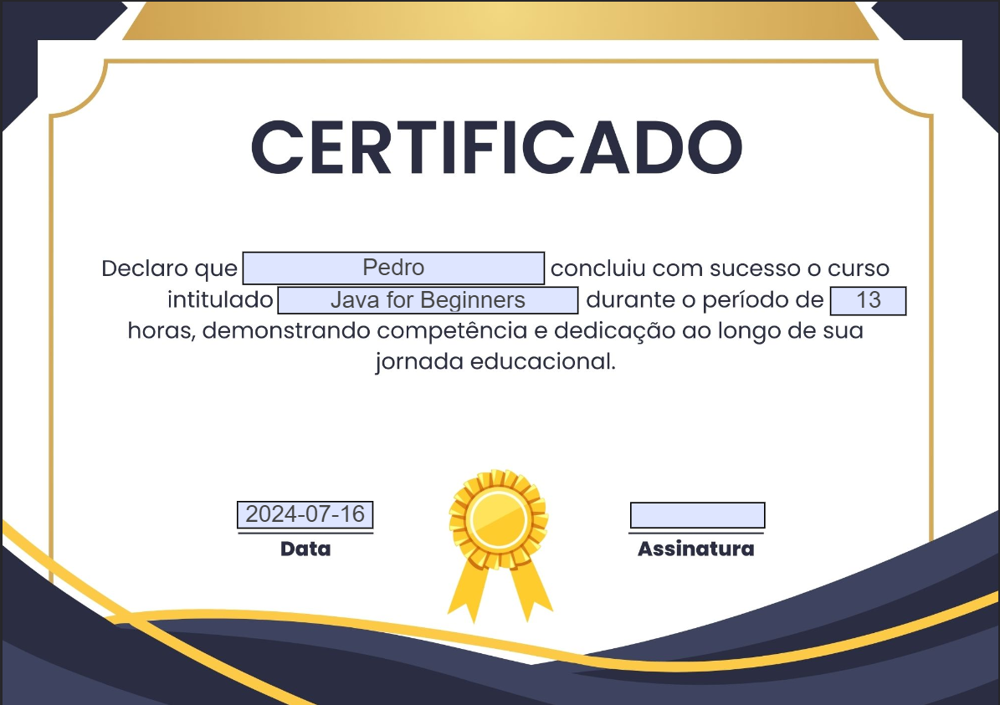

# Gerador de Certificados de Usuários em Cursos

Este projeto é um sistema para gerar certificados de usuários que participaram de cursos.

### Certificado Base


### Certificado Preenchido



## Tecnologias Utilizadas

- Java com Spring Framework
- Docker e Docker Compose (MongoDB e MongoExpress)
- IText para geração de PDFs

## Funcionalidades

### 1. Criação de Usuário

Endpoint para criar um novo usuário:

```http
POST /api/users
Request Body:
{
  "name": "Pedro",
  "lastName": "Esteves",
  "email": "pedro@email.com",
  "birthDate": "2002-11-07"
}
Response:
{
  "id": "6696b380216e7909949e11f4",
  "name": "Pedro",
  "lastName": "Esteves",
  "email": "pedro@email.com",
  "birthDate": "2002-11-07",
  "coursesId": []
}
```

### 2. Criação de Curso

Endpoint para criar um novo curso:

```http
POST /api/courses
Request Body:
{
  "name": "Java for Beginners",
  "description": "Course to beginners in programing language Java",
  "duration": 13,
  "teacher": "Pedro Henrique Guedes"
}
Response: 200 OK
```
### 3. Registrar um Usuário em Curso

Endpoint para registrar um usuário em um curso:

```http
POST /api/users/{userId}/course/{courseId}
Response: 200 OK
```

### 4. Marcar Curso como Concluído para Usuário

Endpoint para marcar um curso como concluído para um usuário:

```http
PUT /api/users/{userId}/course/{courseId}/completed
Response: 200 OK
```

### 5. Gerar Certificado

Endpoint para gerar um certificado para um usuário em um curso:

```http

POST /api/certificates/generate/{userId}/{courseId}
Response: Certificate generated !!
```